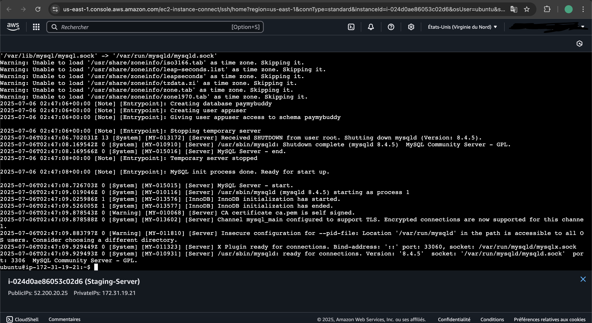
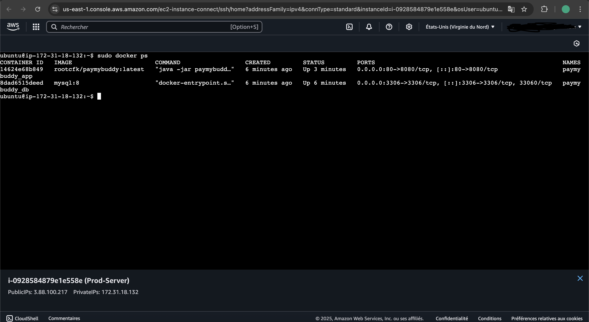
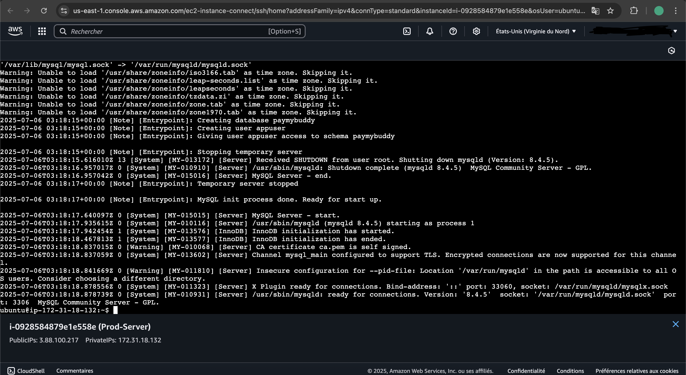
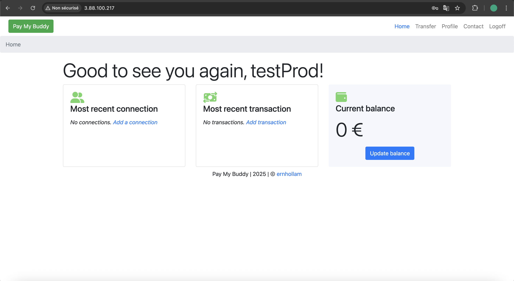

Compte-Rendu Projet déploiement d'une application Spring Boot dans AWS via une pipeline CI/CD avec Jenkins

Création des serveurs de Jenkins, Staging et Production

L’appli dans staging est disponible en staging

L’appli dans staging est disponible en production

