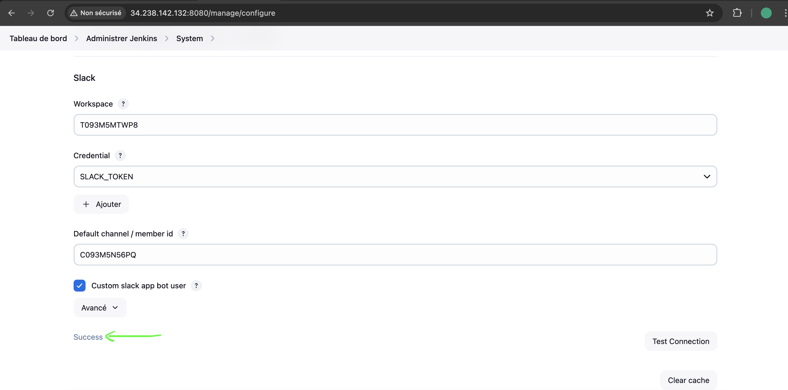
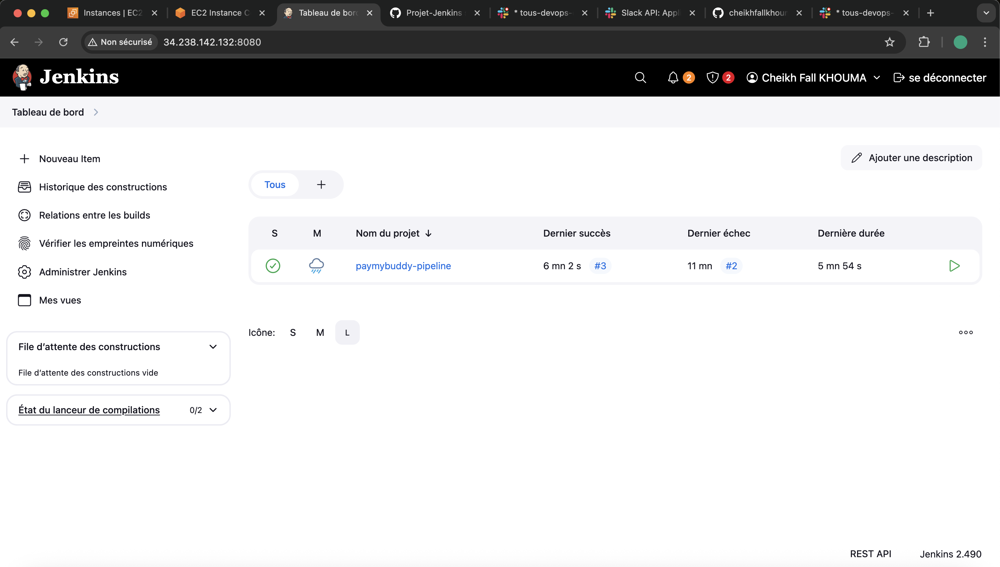
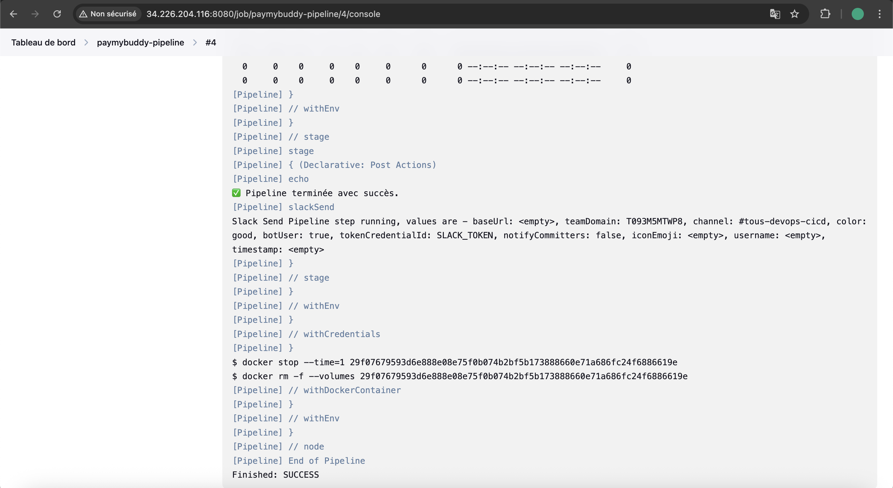
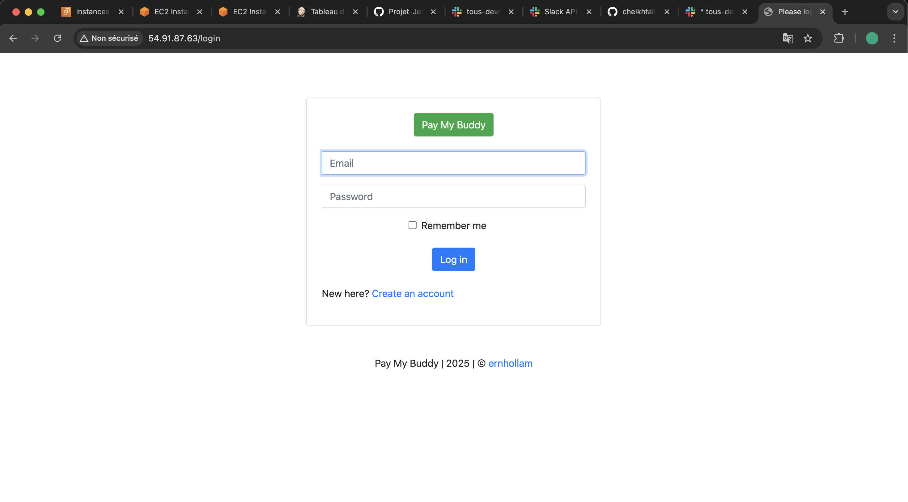
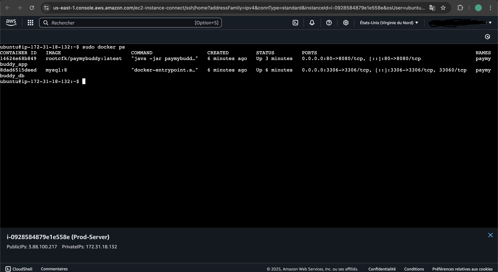
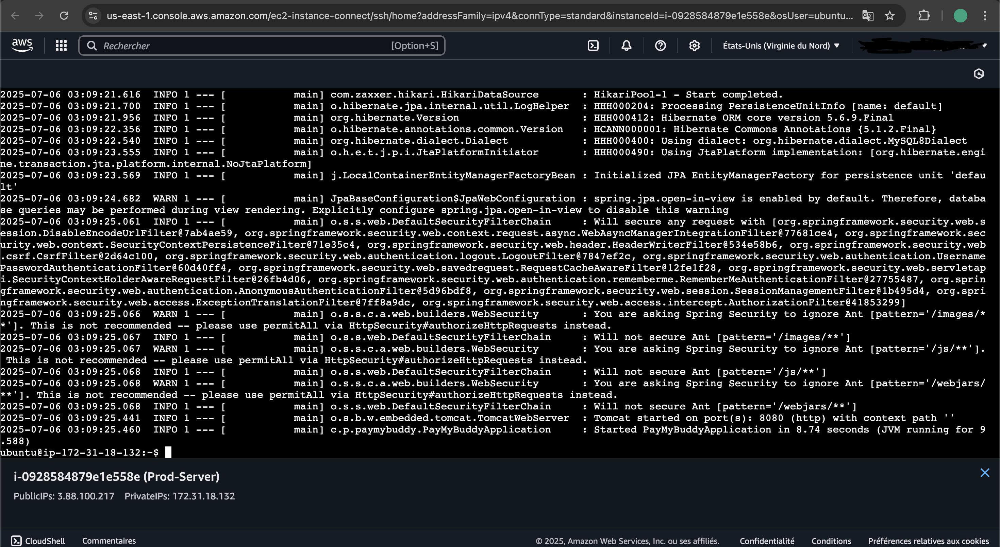
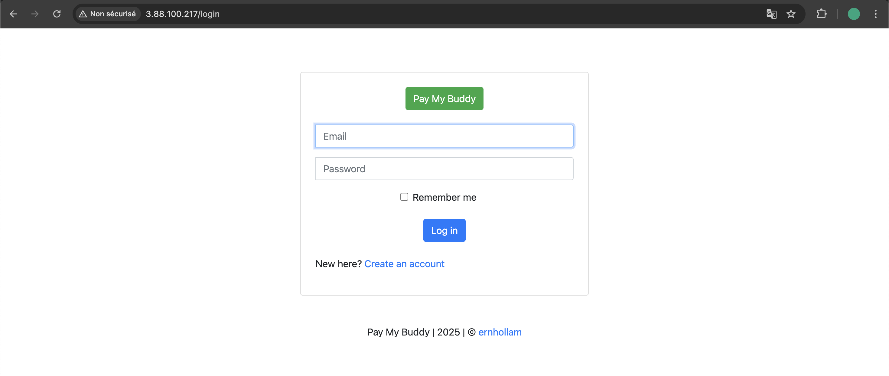

# PayMyBuddy

# Projet : Création d'une Pipeline CI/CD avec Jenkins

## Objectif
L'objectif de ce projet est de concevoir une pipeline d'intégration continue (CI) et de déploiement continu (CD) pour le déploiement d'une application [spring boot](https://github.com/cheikhfallkhouma/Projet-Jenkins) sur un serveur accessible via SSH. L'apprenant devra mettre en œuvre les étapes nécessaires pour assurer la qualité et la sécurité du code tout en automatisant le processus de déploiement.

## Étapes de la Pipeline CI/CD

La pipeline doit inclure les étapes suivantes et les étapes doivent etre executés avec un agent de type docker:

1. **Tests Automatisés**
   - Exécution de tests unitaires et d'intégration

2. **Vérification de la Qualité de Code**
   - Analyse statique du code pour respecter les normes de qualité avec [Sonarcloud](https://docs.sonarsource.com/sonarqube-cloud/).

3. **Compilation et Packaging**
   - Generation du fichier compilé de l'app du code source, build de l'image et envoi de l'image sur DockerHub

4. **Staging**
   - Déploiement dans un environnement de pré-production.

5. **Production**
   - Déploiement final dans l'environnement de production.

6. **Tests de Validation des Déploiements**
    - Vérification que le déploiement a réussi et que l'application fonctionne comme prévu.

NB: A la fin de la pipeline une notification via slack portant sur le statu de la pipeline doit etre envoyé.

## Modèle Gitflow

- Sur la **branche principale** (`main`), toutes les étapes doivent être exécutées, sauf le déploiement en review.
- Sur les **autres branches**, seules les étapes suivantes doivent être exécutées :-
  - Tests Automatisés
  - Vérification de la Qualité de Code
  - Compilation et Packaging

## Exigences Techniques

- Utiliser un fichier `Jenkinsfile` pour définir la pipeline.
- S'assurer que le script est optimal et respecte les meilleures pratiques de CI/CD.

## Résultats Attendus

À la fin de ce projet, l'apprenant doit être capable de :

- Configurer une pipeline CI/CD complète avec Jenkins.
- Déployer une application web de manière sécurisée et automatisée.
- Garantir la qualité et la sécurité du code à chaque étape du processus de développement.

## Ressources
- [Formation Jenkins ](https://eazytraining.fr/cours/jenkins-ci-cd-pour-devops/)
- [Documentation Jenkins](https://www.jenkins.io/doc/)
- [Meilleures pratiques CI/CD avec Jenkins](https://www.jenkins.io/doc/book/pipeline/#best-practices)

Compte-Rendu Projet déploiement d'une application Spring Boot dans AWS via une pipeline CI/CD avec Jenkins

Création des serveurs de Jenkins, Staging et Production

L’appli dans staging est disponible en staging

L’appli dans staging est disponible en production

